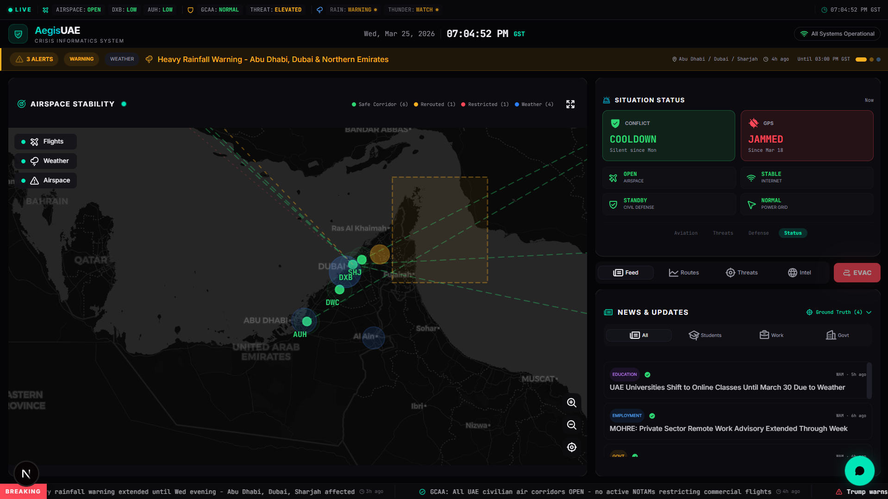
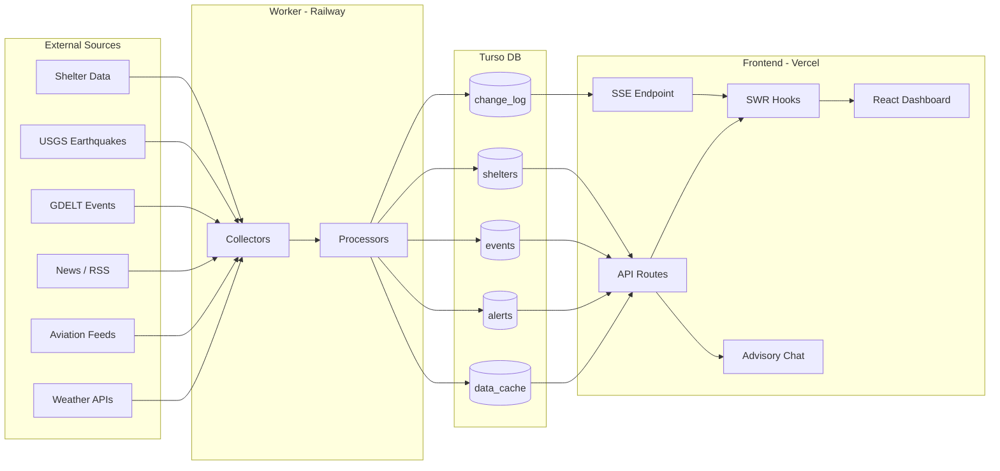

<p align="center">
  
</p>

<h1 align="center">AegisUAE - Crisis Information System</h1>

<p align="center">
  <strong>Real-time crisis informatics command center for UAE national resilience</strong>
</p>

<p align="center">
  Airspace monitoring &bull; Threat tracking &bull; Defense analytics &bull; Evacuation routing &bull; AI-powered advisory
</p>

<p align="center">
  
  
  
  
  
  
</p>

---

## Overview

AegisUAE is a mission-critical crisis informatics dashboard providing real-time situational awareness during national emergencies in the UAE. The system aggregates live data from weather services, aviation feeds, seismic networks, news wires, and the GDELT global event database, processes it through a background worker pipeline, and presents it through a unified command interface.

The platform features an interactive airspace stability map, threat intelligence timeline, evacuation route planner, shelter finder, and a context-aware advisory chatbot powered by Groq (Llama 3.3 70B).

---

## Tech Stack

| Layer | Technology |
|-------|-----------|
| Framework | Next.js 16.2 (App Router) |
| Runtime | React 19 |
| Language | TypeScript 6.0 (strict mode) |
| Styling | Tailwind CSS 4.2 + shadcn/ui + Base UI |
| Icons | Phosphor Icons, Lucide React |
| Maps | Leaflet 1.9, MapLibre GL, deck.gl, react-map-gl |
| Charts | Recharts 3.8 |
| Animations | Framer Motion 12 |
| Data Fetching | SWR 2.4 with custom hooks |
| Database | Turso (libSQL) via `@libsql/client` |
| AI Chat | Groq SDK (Llama 3.3 70B Versatile) |
| Background Jobs | Node.js worker with `node-cron` |
| Analytics | Vercel Analytics |
| RSS Parsing | `rss-parser` |

---

## Architecture Overview

The system is composed of three main layers:

### 1. Frontend (Next.js on Vercel)

A single-page dashboard built with React 19 and Next.js App Router. All data is fetched client-side via SWR hooks that poll Next.js API routes. Real-time updates are delivered through Server-Sent Events (SSE).

### 2. API Routes (Next.js API on Vercel)

Thin API layer that reads pre-processed data from the Turso database cache. Each route serves a specific data domain (alerts, weather, flights, threats, etc.). The API also handles user tracking, admin analytics, and the advisory chat endpoint.

### 3. Background Worker (Node.js on Railway)

A standalone Node.js process that runs on cron schedules. It collects raw data from external sources, processes and enriches it, then writes the results to Turso. It exposes a `/health` endpoint for Railway health checks.

### 4. Turso Database (libSQL)

A hosted SQLite-compatible database (Turso) that acts as the shared data layer between the worker and the frontend. The worker writes; the frontend reads.

---

## Data Flow



### ASCII Diagram

```
External Sources          Worker (Railway)         Turso DB           Frontend (Vercel)
================          ================         ========           =================

Weather APIs    --+
Aviation Feeds  --+       +-------------+
News / RSS      --+-----> | Collectors  |          +------------+     +----------------+
GDELT Events   --+       +------+------+          |            |     | API Routes     |
USGS Quakes    --+              |           +---> | data_cache |---> | /api/alerts    |
Shelter Data   --+       +------v------+    |     | alerts     |     | /api/weather   |
                          | Processors  |----+     | events     |     | /api/flights   |
                          +-------------+    |     | shelters   |     | /api/threats   |
                           (every 5-15m)     |     | system_    |     | /api/news      |
                                             |     |   status   |     | /api/chat      |
                                             +---> | change_log |---> | /api/sse       |
                                                   +------------+     +-------+--------+
                                                                              |
                                                                       SWR Hooks + SSE
                                                                              |
                                                                    +---------v--------+
                                                                    |  React Dashboard |
                                                                    |  (Single Page)   |
                                                                    +------------------+
```

---

## Database Schema

All tables are defined in `worker/db/schema.ts` and initialized on worker startup.

### `data_cache`

General-purpose key-value cache for processed data blobs.

| Column | Type | Description |
|--------|------|-------------|
| `key` | TEXT (PK) | Cache key (e.g., `"alerts"`, `"weather"`, `"flights"`) |
| `data` | TEXT | JSON-serialized payload |
| `fetched_at` | TEXT | ISO 8601 timestamp of last fetch |
| `ttl_seconds` | INTEGER | Time-to-live in seconds (default: 300) |

### `alerts`

Active crisis alerts displayed in the banner and map.

| Column | Type | Description |
|--------|------|-------------|
| `id` | TEXT (PK) | Unique alert identifier |
| `severity` | TEXT | Alert severity level |
| `category` | TEXT | Alert category |
| `title` | TEXT | Short alert title |
| `description` | TEXT | Detailed description |
| `source` | TEXT | Originating source |
| `regions` | TEXT | Affected regions (JSON array) |
| `issued_at` | TEXT | When the alert was issued |
| `expires_at` | TEXT | Expiration timestamp |
| `active` | INTEGER | 1 = active, 0 = expired |

### `events`

Geopolitical and crisis events sourced from GDELT and other feeds.

| Column | Type | Description |
|--------|------|-------------|
| `id` | TEXT (PK) | Unique event identifier |
| `timestamp` | TEXT | Event timestamp |
| `type` | TEXT | Event type classification |
| `headline` | TEXT | Event headline |
| `detail` | TEXT | Full event details |
| `source` | TEXT | Data source |
| `sentiment` | TEXT | Sentiment analysis result |
| `region` | TEXT | Geographic region |
| `raw_data` | TEXT | Original raw payload (JSON) |

### `shelters`

Emergency shelter locations and metadata.

| Column | Type | Description |
|--------|------|-------------|
| `id` | TEXT (PK) | Unique shelter identifier |
| `name` | TEXT | Shelter name |
| `type` | TEXT | Shelter type |
| `lat` | REAL | Latitude |
| `lng` | REAL | Longitude |
| `capacity` | INTEGER | Maximum occupancy |
| `amenities` | TEXT | Available amenities (JSON) |
| `last_verified` | TEXT | Last verification timestamp |

### `system_status`

Key-value store for dashboard status indicators.

| Column | Type | Description |
|--------|------|-------------|
| `key` | TEXT (PK) | Status key (e.g., `"aviation"`, `"security"`) |
| `value` | TEXT | Current value |
| `status` | TEXT | Status level (default: `"normal"`) |
| `tooltip` | TEXT | Hover tooltip text |
| `updated_at` | TEXT | Last update timestamp |

### `change_log`

Append-only log used to drive SSE real-time notifications.

| Column | Type | Description |
|--------|------|-------------|
| `id` | INTEGER (PK, auto) | Auto-incrementing ID |
| `channel` | TEXT | Data channel that changed |
| `changed_at` | TEXT | Timestamp of the change |

### `page_views`

Analytics tracking for visitor page views.

| Column | Type | Description |
|--------|------|-------------|
| `id` | INTEGER (PK, auto) | Auto-incrementing ID |
| `path` | TEXT | Page path visited |
| `referrer` | TEXT | Referrer URL |
| `user_agent` | TEXT | Browser user agent string |
| `country` | TEXT | Visitor country |
| `city` | TEXT | Visitor city |
| `device` | TEXT | Device type (desktop/mobile/tablet) |
| `session_id` | TEXT | Session identifier |
| `created_at` | TEXT | Timestamp |

### `conversations`

Chat message history for the advisory chatbot.

| Column | Type | Description |
|--------|------|-------------|
| `id` | INTEGER (PK, auto) | Auto-incrementing ID |
| `session_id` | TEXT | Chat session identifier |
| `role` | TEXT | Message role (`"user"` or `"assistant"`) |
| `content` | TEXT | Message content (truncated to 2000 chars) |
| `has_image` | INTEGER | 1 if user attached an image |
| `created_at` | TEXT | Timestamp |

### `interactions`

User interaction tracking for analytics.

| Column | Type | Description |
|--------|------|-------------|
| `id` | INTEGER (PK, auto) | Auto-incrementing ID |
| `type` | TEXT | Interaction type |
| `target` | TEXT | Interaction target element |
| `meta` | TEXT | Additional metadata (JSON) |
| `session_id` | TEXT | Session identifier |
| `created_at` | TEXT | Timestamp |

---

## API Routes

All routes are located under `src/app/api/` and use Next.js Route Handlers.

### Data Endpoints

| Method | Route | Description |
|--------|-------|-------------|
| GET | `/api/alerts` | Active crisis alerts |
| GET | `/api/weather` | Weather data and warnings |
| GET | `/api/flights` | Live flight tracking data |
| GET | `/api/flights/connectivity` | Airport connectivity index |
| GET | `/api/news` | Aggregated news articles |
| GET | `/api/news/ticker` | Breaking news ticker items |
| GET | `/api/threats` | Threat intelligence feed |
| GET | `/api/threats/stats` | Threat statistics and counts |
| GET | `/api/intel` | Geopolitical intelligence (GDELT) |
| GET | `/api/earthquakes` | Seismic activity data |
| GET | `/api/evacuation` | Evacuation route information |
| GET | `/api/shelters` | Emergency shelter locations |
| GET | `/api/status` | System status indicators |
| GET | `/api/stats` | Dashboard statistics |

### Real-time

| Method | Route | Description |
|--------|-------|-------------|
| GET | `/api/sse` | Server-Sent Events stream for live updates |

### Chat

| Method | Route | Description |
|--------|-------|-------------|
| POST | `/api/chat` | Advisory chatbot (Groq / Llama 3.3 70B) |

### Analytics and Admin

| Method | Route | Description |
|--------|-------|-------------|
| POST | `/api/track` | Page view and interaction tracking |
| GET | `/api/admin` | Admin dashboard analytics (auth required) |
| POST | `/api/admin/alert` | Manually create/manage alerts (auth required) |

### Background

| Method | Route | Description |
|--------|-------|-------------|
| GET | `/api/cron/refresh` | Vercel cron-triggered data refresh |

---

## Frontend Components

### Layout

| Component | File | Purpose |
|-----------|------|---------|
| Header | `src/components/layout/Header.tsx` | Brand bar, system clock, navigation |
| StatusTicker | `src/components/layout/StatusTicker.tsx` | Real-time status ribbon (aviation, security, weather) |
| AlertBanner | `src/components/layout/AlertBanner.tsx` | Auto-rotating critical alert banners |
| NewsTicker | `src/components/layout/NewsTicker.tsx` | Breaking news horizontal ticker |

### Domain Modules

| Component | File | Purpose |
|-----------|------|---------|
| StabilityMap | `src/components/map/StabilityMap.tsx` | Interactive map with flights, weather zones, airspace |
| StatsCarousel | `src/components/stats/StatsCarousel.tsx` | Rotating analytics cards |
| TruthFeed | `src/components/feeds/TruthFeed.tsx` | Categorized news feed with ground truth section |
| ThreatTimeline | `src/components/threat/ThreatTimeline.tsx` | Chronological threat events with intercept data |
| ConnectivityIndex | `src/components/aviation/ConnectivityIndex.tsx` | Airport route connectivity matrix |
| FlightPulse | `src/components/aviation/FlightPulse.tsx` | Airport performance indicators |
| LatestDevelopments | `src/components/intel/LatestDevelopments.tsx` | Geopolitical developments with sentiment analysis |
| EvacuationRoutes | `src/components/evacuation/EvacuationRoutes.tsx` | Multi-modal evacuation route planner |
| ShelterFinder | `src/components/shelter/ShelterFinder.tsx` | Emergency shelter locator |
| FloatingAdvisory | `src/components/advisory/FloatingAdvisory.tsx` | Floating action button for chat |
| AdvisoryModal | `src/components/advisory/AdvisoryModal.tsx` | Full chat interface modal |
| SituationStatus | `src/components/status/SituationStatus.tsx` | Situation overview panel |

### SWR Hooks

All hooks are in `src/hooks/` and use SWR for data fetching with automatic revalidation.

| Hook | Description |
|------|-------------|
| `useAlerts` | Fetches active alerts |
| `useWeather` | Fetches weather data |
| `useFlights` | Fetches flight tracking data |
| `useConnectivity` | Fetches airport connectivity index |
| `useNews` | Fetches news articles |
| `useNewsTicker` | Fetches breaking news ticker items |
| `useThreats` | Fetches threat intelligence |
| `useIntel` | Fetches geopolitical intel |
| `useEvacuation` | Fetches evacuation routes |
| `useShelters` | Fetches shelter locations |
| `useEarthquakes` | Fetches seismic activity data |
| `useStats` | Fetches dashboard statistics |
| `useStatus` | Fetches system status indicators |
| `useSSE` | Subscribes to SSE stream for real-time data invalidation |
| `useAlertSound` | Plays audio alert on new critical alerts |
| `useTracking` | Tracks page views and user interactions |

---

## Worker Pipeline

The worker (`worker/index.ts`) runs as a standalone Node.js process on Railway.

### Collectors

Fetch raw data from external sources and write to Turso.

| Collector | File | Schedule | Description |
|-----------|------|----------|-------------|
| Weather | `worker/collectors/weather.ts` | Every 10 min | Weather warnings and forecasts |
| Flights | `worker/collectors/flights.ts` | Every 5 min | Live aviation data |
| News | `worker/collectors/news.ts` | Every 5 min | RSS and news aggregation |
| GDELT | `worker/collectors/gdelt.ts` | Every 15 min | Global event database |
| Earthquakes | `worker/collectors/earthquakes.ts` | Every 15 min | USGS seismic feeds |
| Shelters | `worker/collectors/shelters.ts` | Daily at 03:00 UTC | Shelter location data |

### Processors

Transform and enrich collected data, then update the cache.

| Processor | File | Description |
|-----------|------|-------------|
| Status | `worker/processors/status.ts` | Computes system status indicators |
| Alerts | `worker/processors/alerts.ts` | Generates alerts from weather and seismic data |
| Threats | `worker/processors/threats.ts` | Processes GDELT events into threat timeline |
| Connectivity | `worker/processors/connectivity.ts` | Calculates airport connectivity scores |

### Maintenance

- **Change log pruning**: Runs hourly to clean up old SSE notification entries.

---

## Environment Variables

Create a `.env.local` file in the project root for local development.

### Required

| Variable | Description | Used By |
|----------|-------------|---------|
| `TURSO_DATABASE_URL` | Turso database connection URL | Frontend + Worker |
| `TURSO_AUTH_TOKEN` | Turso authentication token | Frontend + Worker |

### Optional

| Variable | Description | Default | Used By |
|----------|-------------|---------|---------|
| `GROQ_API_KEY` | Groq API key for advisory chatbot | _(chat disabled if unset)_ | Frontend |
| `ADMIN_KEY` | Admin dashboard authentication key | `aegis2026` | Frontend |
| `CRON_SECRET` | Secret for Vercel cron route authentication | _(none)_ | Frontend |
| `PORT` | Health check server port for Railway | `3001` | Worker |

---

## Running Locally

### Prerequisites

- Node.js 20+
- npm 10+ (or pnpm/yarn)
- A Turso database (free tier at [turso.tech](https://turso.tech))

### 1. Install Dependencies

```bash
cd frontend
npm install
```

### 2. Configure Environment

```bash
cp .env.example .env.local
# Edit .env.local with your Turso credentials and optional API keys
```

### 3. Start the Worker

The worker initializes the database schema and begins collecting data.

```bash
npx tsx worker/index.ts
```

### 4. Start the Frontend

```bash
npm run dev
```

Open [http://localhost:3000](http://localhost:3000) in your browser.

### 5. Build for Production

```bash
npm run build
npm start
```

---

## Deployment

### Frontend -- Vercel

The Next.js frontend is deployed to Vercel.

- **Framework Preset**: Next.js (auto-detected)
- **Build Command**: `npm run build`
- **Output Directory**: `.next`
- **Environment Variables**: Set `TURSO_DATABASE_URL`, `TURSO_AUTH_TOKEN`, `GROQ_API_KEY`, `ADMIN_KEY`, and `CRON_SECRET` in the Vercel dashboard.
- **Cron Jobs**: The `/api/cron/refresh` route can be configured as a Vercel cron job for periodic cache refresh as a fallback to the Railway worker.
- **SSE Limitation**: The SSE endpoint auto-closes after 25 seconds to comply with Vercel's serverless function timeout. The client automatically reconnects.

**Production URL**: [https://aegisuae.vercel.app](https://aegisuae.vercel.app)

### Worker -- Railway

The background worker runs as a persistent Node.js service on Railway.

- **Start Command**: `npx tsx worker/index.ts`
- **Environment Variables**: Set `TURSO_DATABASE_URL`, `TURSO_AUTH_TOKEN`, and `PORT` in the Railway dashboard.
- **Health Check**: The worker exposes a `/health` endpoint on the configured port for Railway's health monitoring.
- **Scaling**: Single instance is sufficient; the worker is stateless and idempotent.

### Database -- Turso

- **Provider**: [Turso](https://turso.tech) (hosted libSQL / SQLite edge database)
- **Schema Initialization**: Handled automatically by the worker on startup via `worker/db/schema.ts`.
- **Replication**: Turso supports edge replicas for low-latency reads from Vercel's serverless functions.

---

## License

MIT License. See [LICENSE](LICENSE) for details.

---

<p align="center">
  <sub>
    Crafted by <a href="https://reachvivek.vercel.app">Vivek</a> &middot;
    <a href="https://linkedin.com/in/reachvivek">LinkedIn</a> &middot;
    <a href="https://github.com/reachvivek">GitHub</a> &middot;
    <a href="https://instagram.com/rogerthatvivek">@rogerthatvivek</a>
  </sub>
</p>
